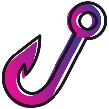

<br />

<p align="center">
 
</p>

<br />

[]()
[]()
[]()
[](https://github.com/prettier/prettier)
[](#contributors-)
[]()

> Makes Angular lifecycle hooks being reactive! 🚀

**Rehooktive** is a lightweight library that lets you have the power of reactive programing over Angular lifecycle hooks.
You can use it to profit the abilities of RxJS and have fully reactive support in your directives/components code.  

## Features

✅&nbsp;&nbsp;Support all lifecycle hooks
<br />
✅&nbsp;&nbsp;Fully decorative solution
<br />
✅&nbsp;&nbsp;Ivy support

## Installation

```
# Using ng
ng add @ngze/rehooktive

# Using yarn
yarn add @ngze/rehooktive

# Using npm
npm i @ngze/rehooktive
```

### Usage

Here is a usage example for reactive `OnChanges` hook:

```ts
export class SimpleComponent {

  @Rehooktive(Hook.OnChanges) // <-- Or any other hook exposed via 'Hook' enum.
  readonly onChanges$: Observable<SimpleChanges>;

  @Input()
  readonly value: number;

  readonly value$ = this.onChanges$
    .pipe(
      map(() => this.value),
      distinctUntilChanged()
    );
}
```

### Without Ivy

In case that you are not using **Ivy**, all you need to carry out is implementing the `OnChanges` hook (or any other hook you are using):

```ts
export class SimpleComponent implements OnChanges {

  @Rehooktive(Hook.OnChanges)
  readonly onChanges$: Observable<SimpleChanges>;

  @Input()
  readonly value: number;

  readonly value$ = this.onChanges$
    .pipe(
      map(() => this.value),
      distinctUntilChanged()
    );

  ngOnChanges() {} // <-- Add empty method for 'OnChanges' hook.
}
```

## Contributors ✨

Thanks goes to these wonderful people ([emoji key](https://allcontributors.org/docs/en/emoji-key)):

<!-- ALL-CONTRIBUTORS-LIST:START - Do not remove or modify this section -->
<!-- prettier-ignore-start -->
<!-- markdownlint-disable -->
<table>
  <tr>
    <td align="center"><a href="https://il.linkedin.com/in/zeev-katz"><br /><sub><b>Zeev Katz</b></sub></a><br /><a href="https://github.com/@ngze/rehooktive/commits?author=ZeevKatz" title="Code"> 💻 </a> <a href="https://github.com/@ngze/rehooktive/commits?author=ZeevKatz" title="Documentation"> 📖 </a> <a href="#ideas-ZeevKatz" title="Ideas, Planning, & Feedback"> 🤔 </a> <a href="#maintenance-ZeevKatz" title="Maintenance"> 🚧 </a></td>
  </tr>
</table>

<!-- markdownlint-restore -->
<!-- prettier-ignore-end -->
<!-- ALL-CONTRIBUTORS-LIST:END -->

This project follows the [all-contributors](https://github.com/all-contributors/all-contributors) specification. Contributions of any kind welcome!
